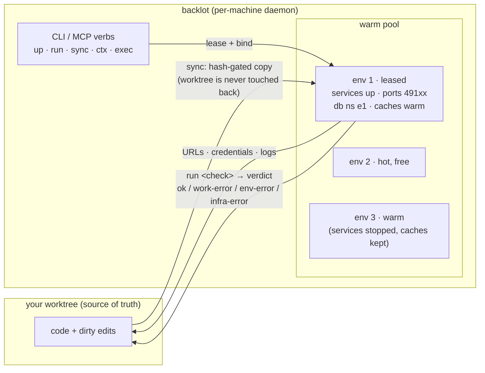

# backlot in two pages

> backlot puts a **working instance of your web app in front of a coding agent** (or a
> human) — running, seeded, logged-in, provable — as a cheap, repeatable act. It brokers
> environments; it never provides them.

This is the condensed, human-first tour. The full design (with every decision argued) is
[`architecture.md`](architecture.md); individual decisions live in [`decisions/`](decisions/).

## The problem, in one paragraph

Agents iterating on a web app constantly need three things: a running instance to
**inspect**, a deterministic environment to **prove** changes against (e2e, with a
machine-readable verdict), and a fix-sync-retest loop that runs in **seconds** — before
any commit, long before CI. Hand-rolled harnesses all reinvent the same machinery (port
allocation, DB namespacing, zombie reaping) welded to one repo. And because environments
are expensive to make, everyone hoards them "just in case" until the machine is full of
half-dead stacks. backlot's answer: keep a small warm **pool** of durable environments,
and make *ownership* — not the environment — the disposable thing.

## How it works

One `stack.yaml` at your repo root declares services, datastores, seed presets, and
checks. A per-machine daemon (auto-spawned by the CLI, nothing to deploy) supervises a
pool of environments, each with its own copy of the tree, its own ports, and its own
datastore namespace. Verbs *lease* an environment, *sync* your worktree into it, and hand
you URLs, credentials, and verdicts.



Two inversions carry the whole design:

- **Environments are durable; leases are disposable.** A lease has a TTL, refreshed by
  the verbs that bind work (`up`, `run`, `sync`) — not by read-only polling. When an
  agent crashes or a human forgets, the lease lapses and the environment returns to the
  pool **warm**, heat intact. Abandonment costs nothing, so nothing gets hoarded.
- **Watchers never move; bindings move.** An environment's dev servers watch the
  environment's *own* tree forever. Pointing them at new work means syncing that work in
  — so caches survive rebinds, ports and URLs stay stable, and your worktree is never
  written to (the sole exception: manifest-declared `outputs:`, copied back only by an
  explicit `backlot pull`).

The safety invariant underneath both: **an environment never holds the only copy of
anything.** Your worktree stays the source of truth; the environment's tree is a
disposable projection. That makes every reclaim — lease expiry, recycle, even losing the
machine — safe by construction.

## An environment's life

```mermaid
stateDiagram-v2
    [*] --> pristine : provision (templates + shared caches)
    pristine --> hot : bind + start (seconds; minutes on first build)
    hot --> hot : rebind (sync + upkeep, seconds)
    hot --> warm : idle TTL — services stop, caches stay
    warm --> hot : next verb (start + ready-wait)
    hot --> degraded : service flaps past its restart budget
    degraded --> pristine : auto-recycled
    warm --> pristine : recycle
```



Binding converges an environment to what you asked for instead of restoring a snapshot:
a fingerprint ledger replays only the upkeep rules whose triggers changed (lockfile →
install, migrations → migrate), and data states restore from baked templates in seconds.
Hygiene is per-bind: `reuse` keeps everything (inspection), `reset-data` restores the
data template and keeps *declared* `caches:` while sweeping undeclared droppings (the
default for runs), `--pristine` rebuilds from scratch (merge-grade verdicts). Two consecutive bind failures on the same environment
auto-escalate the next bind to pristine — the standard defense against stale-cache
heisenbugs.

## A session, concretely

```bash
backlot up                  # lease an env, sync your worktree, start services
backlot ctx --json          # URLs, login creds, DB strings, recent events — all an agent needs
# …edit code in your worktree…
backlot sync                # project the edits in; watchers/caches do the rest
backlot run e2e --json      # second env from the pool, fresh data, JSON verdict
backlot release             # or just walk away — the lease lapses harmlessly
```

Every verb takes `--json`: stdout is one clean data object, stderr is for humans. The
MCP adapter (`backlot-mcp`) exposes the same verbs as tools over the same daemon socket.

## When something fails

The daemon is the parent of every service process, so crash detection is SIGCHLD —
instant, no port-polling guesswork. Readiness is probed (`http`, log marker, or command);
declared `fatal_logs` markers fail a boot in seconds. Every failure is **classified**, and
the class is what an agent branches on:

| Class | Meaning | Exit | Who acts |
| --- | --- | --- | --- |
| `work-error` | your synced code is at fault | 1 | you fix, re-sync |
| `env-error` | the environment is at fault | 2 | backlot recycles it |
| `infra-error` | something external (DB down, registry) | 3 | actionable message, nobody's code blamed |

A service that dies mid-check fails the run *explicitly* as `env-error` — never a
silently wrong verdict that sends an agent off to "fix" healthy code.

## What backlot never does

No compute ownership (local processes now; BYO cloud sandboxes via drivers later). No
build-system knowledge — it invokes your repo's commands, it never understands them. Not
CI — CI may call backlot, never the reverse. Not the agent — no LLM calls, no browser
driving; it guarantees URLs, credentials, data states, and verdicts, and what you do with
them is your business.

## Where to go next

- [`architecture.md`](architecture.md) — the full design, argued
- [`../schema/stack.schema.json`](../schema/stack.schema.json) — the manifest contract;
  [`../examples/`](../examples/) — three runnable fixtures, smallest first
- [`decisions/`](decisions/) — why it is the way it is; a recorded decision outranks code
