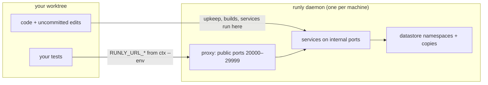

# runly — the guide

runly puts a running, seeded, authenticated instance of your web application in
front of a coding agent or a human, as a cheap, repeatable act. It brokers
environments; it never provides them. This page explains how it behaves. The
[README](../README.md) has the manifest and command references; the design and
every setting are in [`architecture.md`](architecture.md); the reasons are in
[`decisions/`](decisions/).

## How it works

One `runly.yml` at the repo root declares services, datastores, presets and
upkeep rules. A per-machine daemon, started by the CLI on first use, supervises
the services. Each worktree has **one environment**: its services build and run
**in that worktree** (no copy is made, your caches are theirs), and what the
environment keeps to itself is its ports, its datastore namespaces and its logs.


```mermaid
flowchart LR
    subgraph wt["your worktree"]
        SRC["code + uncommitted edits"]
        T["your tests"]
    end
    subgraph d["runly daemon (one per machine)"]
        P["proxy: public ports 20000–29999"]
        S["services on internal ports"]
        DB["datastore namespaces + copies"]
    end
    SRC -- "upkeep, builds, services run here" --> S
    P --> S
    S --> DB
    T -- "RUNLY_URL_* from ctx --env" --> P
```

`runly up` is the only verb that binds. It is additive: it starts the services
you name (plus their `depends_on`), next to whatever already runs, and never
stops one. `runly down` stops services. Every verb takes `--json`; stdout is one
JSON object, stderr is for humans.

## A session

```bash
runly up web                 # lease the environment; start web and its dependencies; prints a summary
runly ctx --json             # the full context: URLs, logins, connection strings, service states
# …edit code…
runly up                     # due upkeep + builds; restarts only what the builds changed
runly up --reset-data        # known data before the tests
eval "$(runly ctx --env)" && pnpm e2e
runly release                # or runly destroy when the worktree is handed back
```

## Running your own tests

runly runs no tests. `runly ctx --env` prints the environment as
`export KEY=value` lines (`runly up --env` prints the same after starting), so
`eval` hands them to your test command:

```bash
eval "$(runly ctx --env)" && npm test
```

| Variable | Value |
| --- | --- |
| `RUNLY_ENV_ID` | the environment's id |
| `RUNLY_PORT_<PORT>` | each public port, by its manifest key |
| `RUNLY_URL_<SERVICE>` | each wanted service's URL |
| `RUNLY_DATASTORE_<NAME>_URL` | each datastore's connection string |
| `RUNLY_DATASTORE_<NAME>_PRESET` | the preset the datastore holds |
| `RUNLY_LOGIN_USER`, `RUNLY_LOGIN_PASSWORD` | the primary login, when the stack declares one |

Names are upper-cased and every other character becomes `_` (`web-audit` →
`RUNLY_URL_WEB_AUDIT`); a value is single-quoted only when a shell needs it.

A test lane that needs a database and not the application takes a **copy**:
`runly db with main -- npm test` restores a fresh copy from the environments'
template, runs the command with `RUNLY_DB_URL` (the connection string),
`RUNLY_DB_DATABASE` (the database's own name on its server, the file for
sqlite) and `RUNLY_DB_COPY` (runly's handle for `db drop`; `RUNLY_DB_NAME` is
the same), drops the copy when it exits (also on failure and Ctrl-C) and exits
with its code. Copies need no lease and run in parallel. The command runs under
a small watchdog tied to the CLI by a pipe: if the `db with` process itself is
killed (SIGKILL, OOM, a kill of its process group the command escaped), the
command is stopped within moments, and the daemon drops the copy at its next
sweep. When runly itself fails (no such datastore, the restore failed), stderr
says `runly db with:` (with `--json`, a `{"runlyDbWith":{…}}` line) and the exit
is 1, 2 or 3 — or the code given with `--runly-exit N` (say 125), so a script can
tell runly's failure from its own command's.

`runly exec <cmd>` is the other way in: the CLI runs the command in the
worktree, on your terminal, with your environment plus the same `RUNLY_*`
variables (and `BACKLOT_URL_*`, `BACKLOT_PORT_*`, `BACKLOT_DS_*`). It exits with
the command's own code; `--json` collects `stdout`, `stderr` and `exitCode`
whole. Services an idle stop or a daemon restart stopped are started first. The
environment is not locked while the command runs, so an `up` next to a long
`exec` is not queued behind it.

## An environment's life

| Event | What happens |
| --- | --- |
| `up` | Creates the worktree's environment if there is none, takes or renews the lease (`--ttl`, default 30 min) and starts services. |
| A service sees no runly verb that uses its environment and no client byte on its port for 10 min (`idle:` per service, `BACKLOT_SERVICE_IDLE_MS`) | That service is stopped (`ps` says `idle`). Its port, data and the lease stay. The verbs that count are `up`, `reset-data`, `exec`, `token`, `preview` and `down`; reading (`ctx`, `ps`, `plan`, `logs`, `status`) does not. |
| A connection reaches an idle service's port | The service starts again (its dependencies too, through their own ports) and the connection is held until it is ready (`BACKLOT_PROXY_HOLD_MS`, 90 s). Only a leased environment wakes; a service stopped with `down` stays down. |
| The holder process dies (`--holder-pid`, `BACKLOT_HOLDER_PID`, or the Claude Code session) | After a one-minute grace (`BACKLOT_TETHER_GRACE_MS`) everything goes: services, data, the copies that process held, preview, ports, lease. While the holder lives, the lease does not expire. |
| The lease's TTL runs out (no holder process) | The lease ends; the environment stays for the worktree's next `up`. Its services stop after their idle time and are not woken by traffic. |
| `release` | The same as a TTL end, now. |
| The worktree is deleted | Everything goes, leased or not, also across a daemon restart. |
| `destroy` | Everything goes now, the worktree's database copies included. For worktree pools that take a worktree back. The worktree's build records, its templates and the upkeep rules that declare `outputs:` stay, so the next `up` does not redo bakes or installs whose output is still there; a rule without `outputs:` runs again (a pool's `git clean` may have removed what it made). |
| No lease, and nothing used the environment for 24 h (`BACKLOT_UNLEASED_TTL`, `off` to keep it) | The environment goes: services, data, ports. Templates and the worktree's records stay, so the next `up` there restores rather than bakes. |
| The box needs a slot (`BACKLOT_POOL_MAX_TOTAL`) | The least recently used unleased environment idle for 30 min (`BACKLOT_IDLE_TTL_MS`) is recycled. |
| A service crashes past its restart budget (4 exits in quick succession) | Leased: that service is stopped and shown `failed` in `ps` and `ctx` with its last exit (`runly logs <svc>` says why); the environment, its data, its other services and its logs stay, and the next `up` starts it again. Unleased: the environment is marked `degraded` and recycled. |

**Claude Code.** Claude Code exports `CLAUDE_PID`, the session process that every
Bash tool call runs under. When it is a live ancestor of the CLI, `up` and
`db new` use it as the holder automatically, so the environment lives exactly as
long as the session and goes a minute after it ends. `BACKLOT_TETHER=off` opts
out (the lease then lives by its TTL). An explicit `--holder-pid` wins.

**Other shells.** `--holder-pid` only helps a process that outlives the command.
`BACKLOT_HOLDER_PID=$$ runly up` from an agent harness names a shell that has
already exited, so runly refuses it (exit 64); use `--ttl` there.

A daemon restart (`runly update`) keeps leases, data and ports; services stop and
the next `up`, `exec` or `token` — or a connection to their port — starts them.
An `up` that failed is redone only by `up`: `ctx` and `ps` name the failure, and
until then nothing starts its services.

### The daemon

The CLI starts the daemon on first use. If it crashes, the next CLI command
starts a new one, which takes the ports back and reaps what the old one left; until
then the ports refuse connections. To have it restarted at once instead, install
a supervisor:

```bash
runly daemon install --print   # show the unit (systemd user unit on Linux, launchd agent on macOS)
runly daemon install           # write and enable it; start the daemon through it if none runs
runly update                   # if a daemon was already running: restart it under the unit (leases survive)
runly daemon uninstall         # disable and remove it
```

The unit restarts the daemon a second after it crashes and leaves its services
alone when it stops. It runs with what `daemon install` captured from the shell
that ran it, and prints that list (and how many variables it left out): `PATH`,
an allowlist (`DOTNET_*`, `NODE_*`, `NVM_*`, `JAVA_HOME`, `DOCKER_HOST`,
`DOCKER_CONTEXT`, `LANG`, `LC_*`, the proxy variables, `SSL_CERT_*`), every
`BACKLOT_*` setting, the variables the manifest's commands reference (`$NAME`)
when installed from a stack, and each `--env NAME`. An `env_from` input is never
stored in the unit: each `up` brings it. Reinstall after changing them. A repo
command that fails because a tool or runtime is missing (`command not found`, no
.NET SDK) is reported as an env-error that says so and how to give the unit the
variable. Once it is installed, a
CLI that finds no daemon starts the unit rather than a daemon of its own, and
`runly status` reports `supervisor: systemd` (or `launchd`). There is one unit
per state root. runly never installs it by itself.

## Ports

Each `port:` gets a **public** port (20000–29999) for the environment's life. The
daemon listens on it and forwards TCP to the service, which is started on a fresh
**internal** port (30000–31999) each time. So:

- a URL survives every restart, and a connection that arrives while the service
  starts is held, not refused;
- in a service's own `run:` and `env:`, its `{{ports.<key>}}` is the internal
  port it must listen on; everywhere else (other services, builds, `exec`, `ctx`)
  ports and `{{services.<svc>.url}}` are public, and `{{public_ports.<key>}}` is
  public everywhere;
- client bytes are counted per port (`proxy` in `ctx --json` and `status
  --json`); runly's readiness probes bypass the proxy and do not count;
- it is plain TCP, so WebSockets pass through;
- a connection the service accepts and drops before answering (it crashed, or
  an `up` is restarting it) is retried with what the client sent, like a
  refused one, instead of reaching the client as an empty reply.

Derived tailnet preview ports use a third block (32000–32767). The blocks sit
below the OS ephemeral range and can be moved with `BACKLOT_PORT_RANGE`,
`BACKLOT_INTERNAL_PORT_RANGE` and `BACKLOT_TUNNEL_PORT_RANGE` (`LO-HI`). A public
port moves only when it cannot be held (another process took it while the daemon
was down), and the move is reported.

## What `up` does

1. Runs the **upkeep** rules whose trigger files changed since they last ran in
   this worktree (`upkeep: - { when: pnpm-lock.yaml, run: pnpm install }`).
2. Runs the `build:` of every service it runs, in `depends_on` waves: a build
   waits for the builds of what its service depends on, and the builds of one
   wave run at once. `builds: serial` (stack) runs them one at a time, and
   `build: { serial: true }` runs one build alone. runly keeps no build cache:
   the build tool decides what is current. A `build: { run, when: [globs] }` is
   skipped while the matched files are unchanged since its last successful build
   and its declared `outputs:` are still what that build left (deleted or
   overwritten outputs build again) (`build api: skipped (when: unchanged)`);
   `--rebuild` forces it.
3. Restarts a running service only when its build changed its `outputs:` (path,
   size and mtime, or bytes with `compare: content`). A service with a build and
   no `outputs:` restarts after every build; one without a build keeps running
   (a dev server reloads itself). Dependents of a restarted service are not
   restarted: its port did not move.
4. Starts the services that are not running yet.

On the full path (below) the datastores are restored while the services build;
the services start once both are done. A datastore's `create:` must therefore
not need a service's build; put such a step in an upkeep rule.

A changed manifest, changed caller inputs, an upkeep rule that ran, a moved port,
`--reset-data`/`--pristine`, or an environment that is unhealthy or has nothing
running take the **full** path instead: stop everything, prepare data, build,
start. `bindDiagnostics` in `up --json` says which path ran (`reused`,
`restarted`, `rebound`), why, and how long each phase and build took.

`runly warm` runs the due upkeep and the builds with no lease and no services,
for an idle worktree just moved to a new commit (`git checkout <sha> && runly
warm`). `--pristine` re-runs every upkeep rule and every build; it never deletes
a file in the worktree, so use it after deleting `node_modules` by hand. Two
failed binds in a row escalate to it automatically — but never for an
environment you already hold: its data is your work, so runly leaves the choice
to you.

Because everything runs in your worktree, its output lands there too. Declare
build output under `caches:` or git-ignore it, or an upkeep `when:` may match it.
Tests see the live worktree: an edit made while they run is visible to the
services. Parallel lanes need separate worktrees; a second holder of the same
worktree waits for its environment.

Upkeep and datastore commands time out after 300 s, builds after 600 s (an
upkeep rule's `timeout:`; `BACKLOT_CMD_TIMEOUT_S` overrides all, and also gives
`exec`, which has no deadline otherwise, one).
Every command runs under `sh` (dash on Ubuntu, bash as sh on macOS), so write
POSIX sh.

## Data

Every datastore exists for the environment's whole life and keeps its data across
`up`, new holders and daemon restarts. To change it, ask:

```bash
runly up --preset main=empty                   # reload main only; restart the services that use it
runly up --preset empty                        # the short form, for a stack with one datastore
runly up --reset-data                          # restore every datastore with the preset it holds
runly reset-data --preset main=dev             # the same on the current lease, starting nothing new
```

A service "uses" a datastore when its `run:`, `build:` or `env:` templates
`{{datastores.<name>.…}}`; when none does, every running service restarts. A
preset must be in the datastore's `presets:`. A new datastore gets
`default_preset.session`, else the first preset, else `default`.

Data states are restored from **templates**: the `create:` command bakes one per
preset, and every environment and copy restores from it (sqlite by file copy with
`template: true`, server drivers through `template_restore:`). A template is keyed
by the `create:` command and, with an upkeep rule
`{ when: "seeds/**", run: "@rebake-template main" }`, by the content of the files
that rule matches. A template whose key matches is reused, also by a new
environment after `destroy`; when the seed files change, the next `up` bakes a new
one and reloads the datastore from it. `--pristine` bakes the current templates
again. Restores of one template run side by side; a failed restore is logged
(`runly status` events, kind `template`) and retried, and only a second failure
rebakes. `ephemeral: true` datastores (Redis-class) have no presets; a reset runs
`drop:` as a flush.

A template keyed by an `@rebake-template` rule is **shared by every worktree of
the same stack name** on the machine: its key is the `create:` command and the
content of the rule's files, nothing about the worktree, so a new worktree with
the same seeds restores instead of baking, and parallel first `up`s bake once.
A worktree whose seeds differ gets its own key; the others are not touched.
`--pristine` in one worktree bakes a template private to it, which it uses
until nothing references it any more; the shared one stays for the rest. A
datastore without such a rule keeps its templates per worktree, and so does one
with `share_templates: false` (for a seed whose result depends on the worktree
beyond those files). Templates a runly before 0.20 baked per worktree are
adopted the first time a worktree needs the same key.

A datastore only tests use, never the application, can be `copies_only: true`:
environments never get one, so it costs nothing until a `runly db new|with`
copy bakes its template (once, then reused). No service may template it, and
`ctx` does not list it.

`runly db new <ds>` makes a copy that lives until you `db drop` it, its holder
process exits, or its worktree is deleted; `db ls` lists them. A server
datastore needs a `drop:` command to be copied. `db new` does not run upkeep;
use `runly warm` first when the seed needs an install.

## The load budget

One daemon admits every start and build on the box against one budget: 70 % of
RAM and 1.5 × cores of **declared** resources, and on Linux free memory above
max(2 GiB, 10 % of RAM). The CPU must not be saturated: with Linux PSI, runnable
work may not have waited for a CPU 70 % of the time over both the last 10 s and
the last minute (`BACKLOT_BUDGET_CPU_PRESSURE`; 100 or more turns this off);
without PSI (macOS), the 1-minute load must be at most 4 × cores. Waking a
service that ran within the last hour skips the CPU check (memory still
applies), and an `up` with nothing to build or start never waits. A build
holds its share only while it builds, and a wave of parallel builds holds their
sum; an idle-stopped service holds none. Undeclared costs are 512M / 0.5 cpu
running and 1G / 1 cpu building.

An `up` (or a wake) that does not fit waits in a first-come queue, shows its
position with `--progress`, and fails with env-error (exit 2) after 10 minutes,
naming what is committed. `runly plan` answers beforehand: "starts now" or what
it would wait for. `BACKLOT_BUDGET=off` disables it; the other knobs are in
[architecture §11](architecture.md#configuration).

## Logs

```bash
runly logs                          # all services, interleaved: "api | …" (last 40 lines)
runly logs api --since up           # only the current api process
runly logs --since 10m --grep 'ERROR|WARN'
runly logs web -f --until 'Compiled successfully' --timeout 300
runly logs --build                  # the last build output of each service, and of upkeep
```

`--until` matches only lines after each service's last start, so a line from
an earlier process never ends the wait. It exits 0 on a match; `--timeout` exits
124. Every
line carries its arrival time; logs survive idle stops and daemon restarts, are
capped at 20 MB per file with one rotation (`BACKLOT_LOG_CAP_BYTES`), and go with
the environment.

## Cleanup

Each environment records how to drop its databases when it creates them, so a
deleted worktree's databases are dropped with the command they were made with.
Templates are kept per datastore and preset (the newest, plus every one an
environment, copy or existing worktree of the stack last restored from), the
rest after an hour. `runly pool doctor` lists what runly left behind
(unreferenced directories and templates, records of deleted worktrees, processes
and listeners of gone environments, and, with a datastore `list:` command,
orphaned server databases in runly's naming); `--fix` removes them. It only
touches runly's own: files under its state root, processes carrying its tag, and
databases of stacks it knows. Other databases show as `foreign-namespace` and
stay.

## Logins and tokens

`auth.logins` takes one login or a list; each may carry a `role` and a
`description` saying what it is for. `ctx` reports `logins` (the primary, the
first entry, always one object) and `allLogins` (every entry). runly does not
create or verify logins; the seed does. `runly token --role <r>` runs
`auth.token` with `{{role}}` and prints `{token, role}`; `--raw` prints the bare
token for an `Authorization` header.

## Caller inputs

`env_from` lists variables a service takes from the shell that runs `up`:

```yaml
services:
  api:
    run: node server.mjs
    env_from: { API_KEY: optional, API_ENDPOINT: required }
```

Only the declared names are sent to the daemon. A missing `required` input is
refused before anything starts; a supplied value overrides a same-named `env:`
entry; an omitted `optional` one keeps the `env:` default or stays unset. Every
`up` refreshes them, and a change restarts the services that use them. Values
live in daemon memory only, are redacted from service logs, and are never
inherited by another holder. After a daemon restart, run `up` with them again.
They reach services and readiness probes, not builds, upkeep or `exec`.

## Previews

`runly preview <service>` publishes one service of your lease; `preview stop`
ends it. The tunnel lives as long as the **lease**: restarts, idle stops and
repeated `up`s leave it up, while `release`, the end of the lease and teardown
end it. A daemon restart (a crash, `daemon stop`, an update) takes the tunnel
down and publishes it again once the daemon holds the ports, with the same
publisher and, where the publisher can pin it, the same address
(`cloudflare-quick` gets a new name); the service wakes on the first request.
`ctx` shows `previewRestore` while that runs, or with the error when it failed;
`preview stop` ends it either way. A bind ends it when the manifest sets `preview.forbidden`,
the service is taken `down`, or its port moves; `--reset-data` keeps it and says
in `previewNotice` that the same URL now serves new data.

| Publisher | Address | Needs |
| --- | --- | --- |
| `cloudflare-quick` (default) | a new `*.trycloudflare.com` name each time | `cloudflared` on `PATH` (or `BACKLOT_CLOUDFLARED`) |
| `cloudflare-named` | `https://<service>-<prefix>.<domain>`, the same next week | `preview.domain`; `cloudflared tunnel login` once for the zone |
| `tailscale` | `https://<machine>.<tailnet>.ts.net:<port>`, tailnet only | `sudo tailscale set --operator=$USER` once; MagicDNS and HTTPS certificates |

Leave `preview.prefix` and `preview.https_port` unset unless one environment of
the stack publishes at a time: the defaults derive from the environment id, so
they are unique. To pin a tailnet port for one publish, use `runly preview web
--https-port 20601`. `tailscale serve` runs in the foreground as a child of the
lease, so nothing remains in tailscale's config when it ends.

## When something fails

Every failure carries a class, and the class says who acts:

| Class | Meaning | Exit | Next step |
| --- | --- | --- | --- |
| `work-error` | your code or manifest is at fault | 1 | fix it, `up` again |
| `env-error` | the environment is at fault | 2 | runly recycles it; `up` again |
| `infra-error` | something external (database down, version skew) | 3 | act on the message; nobody's code is blamed |
| usage | a wrong or removed flag or verb | 64 | read the message |

A service that fails during a bind of your environment — it exits, hits a
`fatal_logs` marker or crash-loops — fails `up` as work-error naming the
service; that service shows `failed` in `ps`, what depends on it is not
started, and the other services keep running (one failed service does not count
as a failed bind). `fatal_logs` fails a
start in seconds instead of waiting for the readiness timeout. When the CLI and
the running daemon are different builds, every verb except `update`, `doctor`
and `daemon stop` fails with infra-error until `runly update` restarts the daemon.

## Security model

- **`runly.yml` commands run with your privileges**, like `make` or npm scripts.
  Review manifests you did not write.
- **The daemon's control socket is local only**: a unix socket in your per-user
  state directory, where file permissions are the authentication. The public
  ports it forwards listen on loopback.
- **Environments are not sandboxes.** Isolation between them is namespacing
  (ports, database names, private directories). For untrusted code, run the whole
  machine in a sandbox.
- **Preview URLs are unauthenticated.** Anyone with a Cloudflare link reaches the
  service, and a `cloudflare-named` link still works tomorrow; put an access
  policy over the zone. Stacks that must never be published set
  `preview.forbidden: true`.

## What runly is not

Not a build system or build cache (it runs your commands; your build tools decide
what is current). Not a test or checks runner (your tests read `ctx --env`). Not
a dev or watch mode (run `up` after a change; a dev server that reloads itself
just keeps running). Not CI, not an agent, and not a compute provider.
